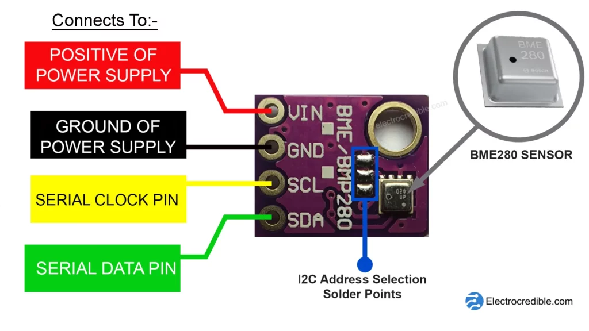
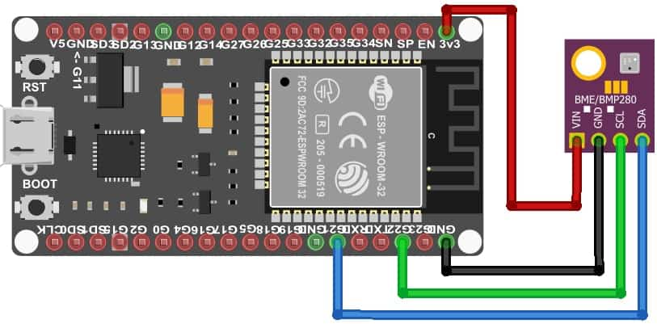

# 🧩 Навчальний модуль: комунікаційні протоколи UART, I2C, SPI для IoT

## 🎯 Мета модуля

Надати початківцям практичне розуміння трьох базових протоколів передачі даних: **UART**, **I2C** та **SPI**, які найчастіше використовуються для підключення сенсорів, модулів і периферії в системах **IoT** та **«розумного дому»**.

---

## 📍 Зміст модуля
1. [🧩 Навчальний модуль: комунікаційні протоколи UART, I2C, SPI для IoT](#-навчальний-модуль-комунікаційні-протоколи-uart-i2c-spi-для-iot)
2. [🎯 Мета модуля](#-мета-модуля)
3. [📡 UART — Простий двосторонній зв’язок](#1-uart--простий-двосторонній-звязок)
4. [🔗 I2C — легка шина для багатьох пристроїв](#2-i2c--легка-шина-для-багатьох-пристроїв)
5. [⚡ SPI — Швидкісний протокол для потужної периферії](#3-spi--швидкісний-протокол-для-потужної-периферії)
6. [📊 Порівняння протоколів](#-порівняння-протоколів)
7. [🎓 Домашнє завдання](#-домашнє-завдання)
8. [📝 Поради викладача](#-поради-викладача)

### 1. UART — Простий двосторонній зв’язок

#### 🔑 Основні тези

- **UART** (*Universal Asynchronous Receiver-Transmitter*) — асинхронний послідовний протокол.
- Використовує лише **2 лінії**: `TX` (передача), `RX` (прийом).
- **Не потребує тактового сигналу** (асинхронний).
- **Повнодуплексний**.
- Придатний для **простого зв’язку між двома пристроями** (наприклад: `ESP32 ↔ GPS модуль`).

---

#### 💡 Приклад: ESP32 ↔ UART-модуль температури  
(наприклад, DS18B20 через UART-конвертер)

```cpp
#include <HardwareSerial.h>

HardwareSerial MySerial(1);

void setup() {
  Serial.begin(115200);
  MySerial.begin(9600, SERIAL_8N1, 16, 17); // RX=16, TX=17
}

void loop() {
  if (MySerial.available()) {
    String data = MySerial.readStringUntil('\n');
    Serial.println("Отримано: " + data);
  }
}
```

> 📌 **Примітка:** UART0 використовується зазвичай для відлагодження через USB UART1 або UART2 — для взаємодії з зовнішніми модулями.


### 2. I2C — легка шина для багатьох пристроїв

#### 🔑 Основні тези

- Використовує лише **2 лінії**:
  - `SCL` (тактова лінія)
  - `SDA` (лінія даних)
- **Напівдуплексний** протокол.
- Підтримує до **127 пристроїв** на одній шині.
- Кожен пристрій має **унікальну 7-бітну або 10-бітну адресу**.
- Добре підходить для **систем з великою кількістю периферійних пристроїв**, де **не критична швидкість передачі**:
  - OLED-дисплеї
  - датчики температури
  - годинники реального часу (RTC)
  - EEPROM

---

#### 💡 Приклад з'єднання: ESP32 ↔ BME280  
*(датчик тиску, вологості та температури, I2C-режим)*

```cpp
#include <Wire.h>
#include <Adafruit_BME280.h>

Adafruit_BME280 bme;

void setup() {
  Wire.begin();                 // Ініціалізація I2C
  Serial.begin(115200);
  bme.begin(0x76);              // Стандартна I2C адреса модуля BME280
}

void loop() {
  Serial.print("Температура: ");
  Serial.println(bme.readTemperature());
  delay(1000);
}
```

> 📌 **Примітка:**  
> **Шина** — це загальна лінія зв’язку, до якої можуть бути підключені кілька пристроїв.  
> У випадку з I2C, **дві спільні лінії (SDA і SCL)** дозволяють головному контролеру (Master) спілкуватися з кількома підлеглими (Slave) пристроями, використовуючи унікальні адреси.  
> Це зменшує кількість дротів і спрощує схему з’єднань у складних системах.

> 📌 **Примітка:**  за замовчуванням ESP32 використовує GPIO21 (SDA) та GPIO22 (SCL) для I2C, але ці пін-и можна змінювати програмно у Wire.begin(SDA, SCL).

### 3. SPI — Швидкісний протокол для потужної периферії

#### 🔑 Основні тези

- Використовує щонайменше **4 лінії**:
  - `SCLK` — тактовий сигнал (Serial Clock)
  - `MISO` — Master In Slave Out (від підлеглого до головного)
  - `MOSI` — Master Out Slave In (від головного до підлеглого)
  - `CS` — Chip Select (вибір пристрою)
- **Повнодуплексний** — передача та прийом даних відбуваються одночасно.
- Працює з **дуже високими швидкостями** передачі (до **80 МГц** на ESP32).
- **Не має адресації** — кожному підключеному пристрою потрібен окремий `CS`.
- Добре підходить для **високошвидкісної периферії**, такої як:
  - TFT-дисплеї
  - SD-карти
  - Ethernet-модулі
  - LoRa-модулі
  - Flash-пам’ять

---

#### 💡 Приклад: ESP32 ↔ SD-карта через SPI

```cpp
#include <SPI.h>
#include <SD.h>

void setup() {
  Serial.begin(115200);
  if (!SD.begin(5)) { // GPIO5 як CS
    Serial.println("Помилка ініціалізації SD!");
    return;
  }
  Serial.println("SD-карта готова.");
  
  File file = SD.open("/test.txt", FILE_WRITE);
  if (file) {
    file.println("Hello, SPI!");
    file.close();
  }
}
```

> 📌 **Примітка:** 
> - SPI дозволяє надзвичайно швидко передавати дані, але не масштабується так легко як I2C.
> - Щоб підключити кілька пристроїв до однієї SPI-шини, потрібно використовувати окремий CS-пін для кожного з них.
> - Наприклад: SD-карта на GPIO5, дисплей на GPIO15 тощо.

## 📊 Порівняння протоколів

| Характеристика        | UART           | I2C                     | SPI                |
|------------------------|----------------|--------------------------|---------------------|
| **Кількість ліній**    | 2              | 2                        | 4+                  |
| **Швидкість**          | Середня        | 100 кГц – 3.4 МГц        | Дуже висока         |
| **Адресація**          | ❌             | ✅                       | ❌                  |
| **Кількість пристроїв**| 1:1            | до 127                   | Обмежено кількістю CS |
| **Тип зв’язку**        | Повнодуплекс   | Напівдуплекс             | Повнодуплекс        |

---

## 🎓 Домашнє завдання

### ✨ Завдання:  
**Зчитування температури з одного і того ж сенсора (BME280) через два протоколи: I2C та SPI.**

---

### 🧰 Необхідні компоненти:

- ESP32

- Датчик **BME280** (з підтримкою I2C та SPI)

- Бредборд та з'єднувальні дроти
> 📌 **Примітка:** 
Схема підключення:

- Arduino IDE

---

### 📋 Інструкція:

1. Підключіть **BME280** до **ESP32** через **I2C** (`SCL`, `SDA`).
2. Напишіть скетч для зчитування температури та виводу її в `Serial Monitor`.
3. Перепідключіть модуль **BME280** на роботу через **SPI** (`SCK`, `MISO`, `MOSI`, `CS`).
4. Змініть скетч для використання SPI та повторно зчитайте температуру.
5. **Порівняйте**:
   - Швидкість реакції
   - Зручність підключення
   - Кількість використаних пінів

---

### 📦 Що потрібно здати:

- Два Arduino-скетчі (для I2C і SPI)
- Фото або схема підключення
- Короткий висновок (3–5 речень) у вигляді коментаря в одному з кодів

---

## 📝 Поради викладача

- 🔌 Для **I2C** не забудьте про **pull-up резистори** (типово **4.7 кОм**) на `SCL` і `SDA`.
- 🔀 Для **SPI** кожен пристрій повинен мати **окремий CS-пін**.
- 🔁 **UART** підходить лише для **1:1 з’єднання** — без мультиплексора на одну лінію не під’єднаєш кілька пристроїв.
- 📚 Використовуйте **бібліотеки Adafruit**, вони значно **спрощують роботу з сенсорами**.

> 🎯 Бонус: спробуйте самостійно змінити частоту шини I2C або SPI та подивіться, як це впливає на час реакції модуля.

---
